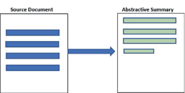
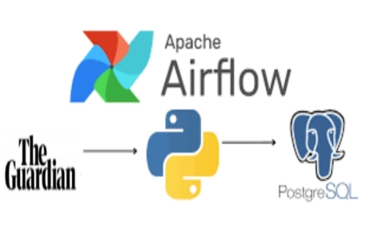
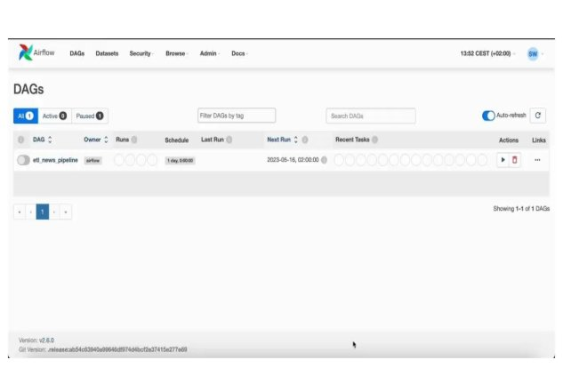
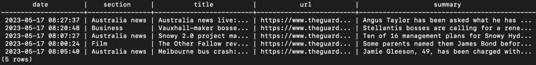
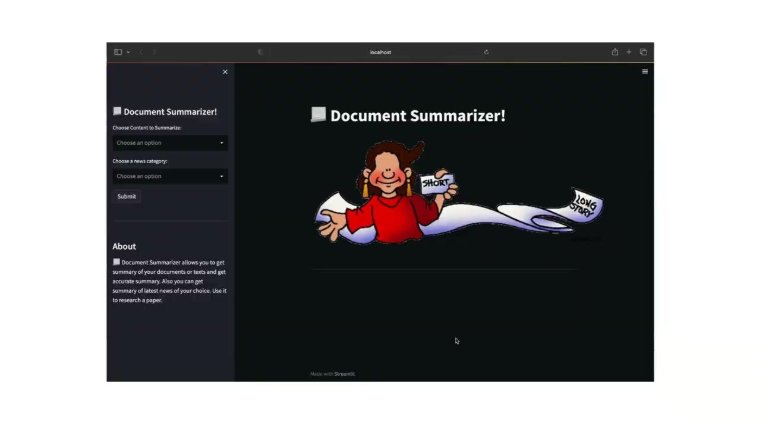

# Document-Summerizer

A document summarizer that provides both real-time news summaries and personalized document summaries. 
- PEGASUS model for summarization,
- the Guardian API for real-time news,
- Apache Airflow for creating an ETL pipeline,
- PostgreSQL for storage, and
- Streamlit for the user interface.

Document Summarizer

# Introduction

- Train model.
- ETL Pipeline.
- Streamlit app:
  - Get real time summary of texts and docs. 
  - Get latest News summary of your choice.

What is Text Summarization?![ref3]

Text  Summarization  is  the  process  of  shortening  a  set  of  data  computationally,  to  create  a  subset  that  represents  the  most  important  or  relevant  information  within  the  original content. 

Types of Summarization

` `

Extractive Text Summarization  Abstractive Text Summarization  

Traditional  method  summary  Advanced  method  summary,  are contains  exact  sentences  from  the  generated  by  the  model,  not  just original text data.  extracted from the original text data

Pegasus

- Pegasus is a pre trained transformer-based  model.  
- Specializing in abstractive text summarization  tasks. Generate summaries that capture the  main ideas and key details of the input text.  
- Dataset: Hugging Face - CNN news mails  
- Model: Pegasus pretrain model fine tuned it  
- Save: save the model locally. 

![ref1]

ETL Pipeline

**E**xtract **T**ransform **L**oad 

Airflow![ref3]

Airflow is an open-source platform used for orchestrating and scheduling complex workflows and data pipelines. It allows users to define, schedule, and monitor workflows as directed acyclic graphs (DAGs). 

A DAG (Directed Acyclic Graph) is a way to represent the flow of tasks. Think of it like a flowchart, where tasks are represented as boxes, and arrows show the order in which they should be executed.

![ref1]

Airflow![ref2]![ref1]

Postgres Table![ref3]![ref1]

Demo![ref2]![ref1]

Future Expansion![ref2]

- Multilingual Support: 
  - Extend the system to provide summaries and news in multiple languages. 
- Audio and Video Summarization.
  - Extend the system to support summarization of audio and video content.
- Sentiment analysis:
- To enhance the summarization process and provide additional insights about the content.

![ref1]

Thank You![ref1]

[ref1]: Images/Aspose.Words.2c2667e0-6c38-4f40-b43f-ed657d0c968b.003.png
[ref2]: Images/Aspose.Words.2c2667e0-6c38-4f40-b43f-ed657d0c968b.005.png
[ref3]: Images/Aspose.Words.2c2667e0-6c38-4f40-b43f-ed657d0c968b.006.png
